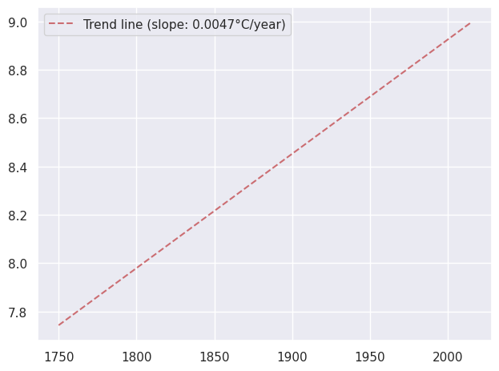

# 🌍 Global Temperature Analysis

## 📌 Project Overview
This project explores historical global temperature trends using data science techniques. It includes exploratory data analysis (EDA) to uncover patterns, seasonal variations, and long-term trends in temperature changes.

The goal is to provide a comprehensive understanding of global temperature changes and highlight key insights using visualizations.

---

## 📂 Dataset Information
- **Dataset Name:** Global Land Temperature Dataset
- **Source:** [Provide dataset source]
- **Attributes:**
  - `dt` (Date)
  - `LandAverageTemperature`
  - `LandMaxTemperature`
  - `LandMinTemperature`
  - `LandAverageTemperatureUncertainty`
  - Other relevant attributes...

---

## 🛠️ Data Preprocessing
- Converted `dt` column to datetime format.
- Extracted `year` and `month` for temporal analysis.
- Handled missing values by visualizing and quantifying them.

---

## 🔍 Exploratory Data Analysis (EDA)
### 📊 Initial Dataset Overview
- **Dataset Shape:** `(rows, columns)`
- **Missing Values Analysis:** [Include missing value percentage table]

---

## 📈 Key Visualizations

### 1️⃣ Temperature Trend Over the Years

📌 **Inference:** [Explain key findings from the graph]

### 2️⃣ Monthly Temperature Patterns

📌 **Inference:** [Describe the seasonal variations observed]

### 3️⃣ Temperature Distribution

📌 **Inference:** [Discuss how temperatures are distributed]

### 4️⃣ Correlation Analysis

📌 **Inference:** [Explain key correlations between variables]

### 5️⃣ Uncertainty in Temperature Measurements

📌 **Inference:** [Discuss how uncertainty has changed over time]

### 6️⃣ Temperature by Decades

📌 **Inference:** [Summarize changes in temperature across decades]

---

## 📊 Summary of Findings
1. **Global Warming Trends:** [Summarize long-term temperature trends]
2. **Seasonal Variations:** [Mention the hottest/coldest months]
3. **Temperature Uncertainty:** [Highlight uncertainty trends]
4. **Missing Data Impact:** [Explain any missing data patterns]
5. **Correlation Insights:** [Summarize relationships between variables]

---

## 🚀 Future Work
- Improve predictive modeling for future temperature projections.
- Extend analysis to include geographic variations.
- Implement anomaly detection for extreme weather patterns.

---

## 📜 Acknowledgments
- Data Source: [Mention dataset source]
- Tools Used: Python, Pandas, Seaborn, Matplotlib, Plotly

📧 For any questions or collaborations, feel free to reach out!

---

🔗 **Author:** [Your Name]

