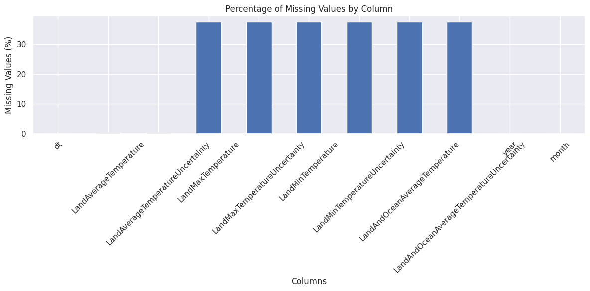
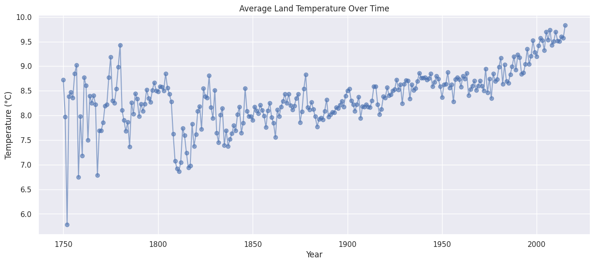
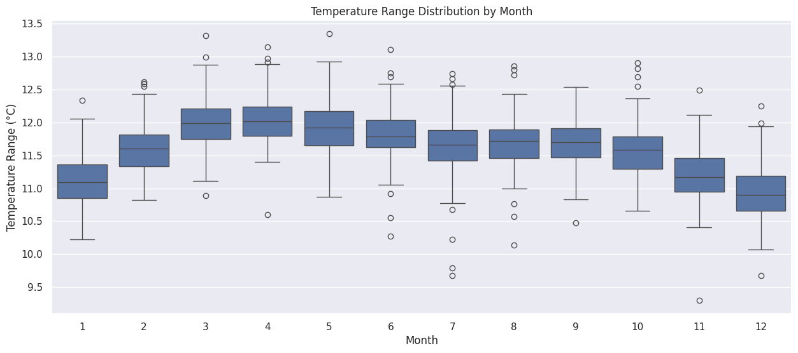
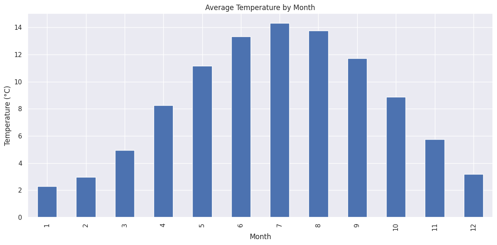
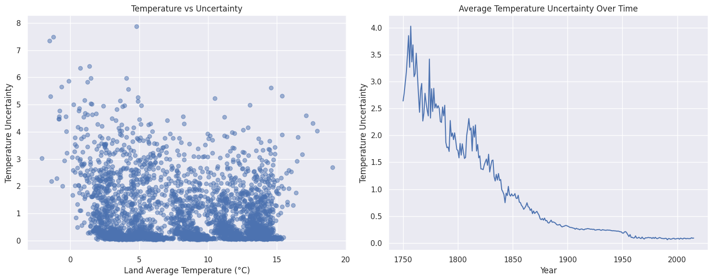
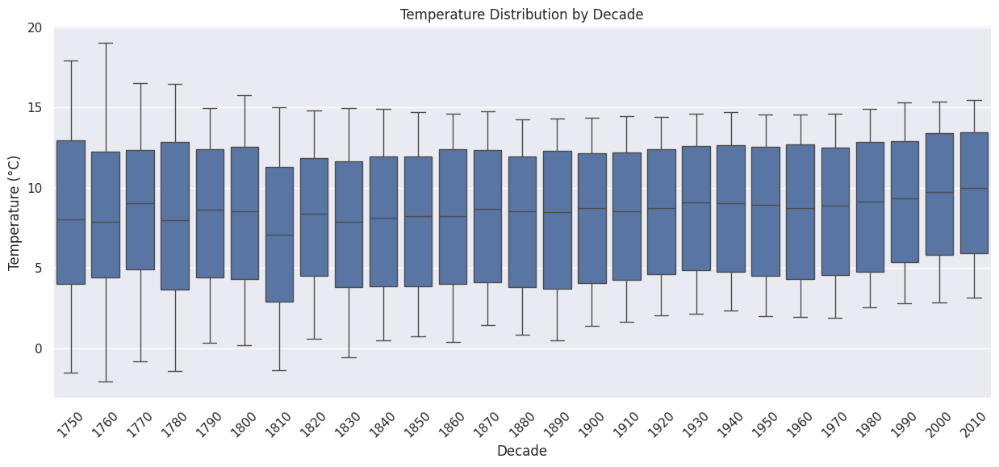

# 🌍 Global Temperature Analysis

## 📌 Project Overview
This project explores historical global temperature trends using data science techniques. It includes exploratory data analysis (EDA) to uncover patterns, seasonal variations, and long-term trends in temperature changes.

The goal is to provide a comprehensive understanding of global temperature changes and highlight key insights using visualizations.

---

## 📂 Dataset Information
- **Dataset Name:** Global Land Temperature Dataset
- **Source:** [Provide dataset source]
- **Attributes:**
  - `dt` (Date)
  - `LandAverageTemperature`
  - `LandMaxTemperature`
  - `LandMinTemperature`
  - `LandAverageTemperatureUncertainty`
  - Other relevant attributes...

---

## 🛠️ Data Preprocessing
- Converted `dt` column to datetime format.
- Extracted `year` and `month` for temporal analysis.
- Handled missing values by visualizing and quantifying them.

---

## 🔍 Exploratory Data Analysis (EDA)

### 📊 Initial Dataset Overview
- **Dataset Shape:** `(3192, 9)`

- **Missing Values Analysis:**  
  | Column Name                                  | Missing Percentage |
  |----------------------------------------------|--------------------|
  | `dt`                                        | 0.00%             |
  | `LandAverageTemperature`                    | 0.38%             |
  | `LandAverageTemperatureUncertainty`         | 0.38%             |
  | `LandMaxTemperature`                        | 37.59%            |
  | `LandMaxTemperatureUncertainty`             | 37.59%            |
  | `LandMinTemperature`                        | 37.59%            |
  | `LandMinTemperatureUncertainty`             | 37.59%            |
  | `LandAndOceanAverageTemperature`           | 37.59%            |
  | `LandAndOceanAverageTemperatureUncertainty` | 37.59%            |
  | `year`                                      | 0.00%             |
  | `month`                                     | 0.00%             |

📌 **Observation:**  
- The dataset has a **significant proportion (37.59%) of missing values** in **maximum, minimum, and ocean temperature-related columns**.  
- `LandAverageTemperature` has **minor missing values (0.38%)**, which can be handled with interpolation or imputation.  
- **No missing values** in `dt`, `year`, and `month`, ensuring **temporal analysis is unaffected**.

---

## 📈 Key Visualizations

### 1️⃣ Temperature Trend Over the Years

### 📌 Inferences**  

- **Long-Term Trend:**  
  - The graph shows a **gradual increase** in average land temperature over the years, indicating a **warming trend**.  
  - While fluctuations exist, the overall pattern suggests **climate change-driven warming**, especially post-1900.  

- **Variability & Fluctuations:**  
  - There are **significant fluctuations** in temperature before the 1900s, with periods of both increase and decrease.  
  - However, **post-1900, temperatures show a more consistent rise**, with fewer drastic drops.  

- **Sharp Increases & Historical Context:**  
  - A **notable increase** in temperature is observed after the mid-20th century, aligning with industrialization and increased greenhouse gas emissions.  
  - The **late 20th and early 21st centuries** show the highest recorded average temperatures.  

📌 **Overall Insight:**  
The data strongly suggests a long-term warming trend, particularly noticeable post-1900. The increase in temperature correlates with human activities, such as industrialization and increased CO₂ emissions, reinforcing concerns about global climate change.  

### 2️⃣ Monthly Temperature Patterns

### 📌 **Inferences**  

#### **Key Observations**  
1. **Temperature Range Variation**  
   - Each box represents the **interquartile range (IQR)** (25th to 75th percentile) of temperature range (°C) for each month.  
   - The **median (central line in each box)** fluctuates slightly across months but remains around **11–12°C**.  
   - The spread (IQR) is relatively **consistent throughout the year**, suggesting stable temperature variations across months.  

2. **Outliers**  
   - Several **outliers** are visible, especially in months like **February, March, April, and October**, indicating occasional extreme variations in temperature range.  
   - The presence of lower outliers in **July, August, and December** suggests some instances of unusually low temperature ranges during these months.  

3. **Seasonal Patterns**  
   - **Higher median temperature ranges are observed from March to May**, possibly indicating the transition to warmer months.  
   - **Lower median temperature ranges in December and January** suggest more stable, colder temperature conditions.  

#### **Conclusion**  
- The temperature range is relatively stable throughout the year, with **minor fluctuations and occasional outliers**.  
- Understanding these variations can be useful for **climate trend analysis, energy consumption forecasting, and agricultural planning**.  

Would you like a month-wise statistical summary or additional visualizations?

### 3️⃣ Temperature Distribution

### 📌 Inferences

- **Seasonal Patterns:**  
  - The temperature range fluctuates throughout the year, with a noticeable increase in the middle months (spring/summer) and a decline in the winter months.  
  - The lowest median temperature range is observed in **January (1st month) and December (12th month)**, while the highest occurs around **March to June**.

- **Variability & Outliers:**  
  - The interquartile range (IQR) remains relatively stable across months, but **April, May, and September** show slightly higher variability.  
  - Outliers are present in almost every month, indicating occasional extreme deviations in temperature range.

- **Gradual Shift:**
  - The months from **January to June** show an increasing trend in temperature range, followed by a gradual decline toward December.  
  - This suggests that **seasonal changes influence temperature fluctuations significantly**.

📌 **Overall Insight:**  
The temperature range distribution exhibits clear seasonal variations, with higher ranges in warmer months and lower ranges in colder months. This pattern aligns with expected climatic changes throughout the year.

### 4️⃣ Correlation Analysis

### 📌 Inferences

- **Strong Positive Correlations:**
  - `LandAverageTemperature` and `LandAndOceanAverageTemperature` (~0.99) indicate a high similarity in trends between land temperatures and combined land-ocean temperatures.
  - `LandMinTemperature` and `LandMaxTemperature` (~0.99) suggest that regions with higher max temperatures also tend to have higher min temperatures.

- **Negative Correlations:**
  - `year` and `LandAverageTemperatureUncertainty` (-0.81) suggest that as time progresses, uncertainty in temperature measurements has decreased.
  - `month` and `temp_range` (-0.26) indicate that certain months may exhibit a lower temperature variation compared to others.

- **Uncertainty Trends:**
  - Uncertainty values are strongly correlated with their respective temperature values (e.g., `LandAverageTemperatureUncertainty` vs. `LandAverageTemperature` at -0.2).
  - `LandAndOceanAverageTemperatureUncertainty` has a high correlation (~0.97) with `LandAverageTemperatureUncertainty`, indicating a similar level of measurement confidence.

- **Impact of Time:**
  - `year` has a slight positive correlation with temperature (0.081), reinforcing the idea of a long-term warming trend.

📌 **Overall Insight:** The correlation matrix reveals a strong internal consistency between different temperature variables while also showcasing decreasing uncertainty in measurements over time.

### 5️⃣ Uncertainty in Temperature Measurements

### 📌 **Inference:** 
#### **1. Temperature vs. Uncertainty (Left Plot)**
- The scatter plot illustrates the **relationship between land average temperature (°C) and temperature uncertainty**.
- **Higher uncertainty is observed at lower temperatures**, while **uncertainty decreases as temperatures rise**.
- A significant concentration of data points near **zero uncertainty** indicates improved measurement accuracy over time.

#### **2. Temperature Uncertainty Over Time (Right Plot)**
- The line plot shows a **steady decline in temperature uncertainty from the 18th century onward**.
- **Early records (1750–1850)** had **high uncertainty**, likely due to limited measurement techniques and sparse data.
- **From the 1900s onward**, uncertainty significantly decreased, reflecting **improved instruments and data collection methods**.

### **Key Takeaways**
- **Technological advancements and better methodologies** have contributed to **reduced uncertainty** in temperature measurements over time.
- **Uncertainty remains low in modern data**, increasing the reliability of recent climate assessments.

Would you like a statistical summary or further breakdown of specific periods?

### 6️⃣ Temperature by Decades

### 📌 **Inference:**  

1. **Overall Trend:**  
   - The **median temperature** (central line in each box) shows a **gradual increase** over the decades, particularly after **1900**.  
   - The **interquartile range (IQR)** remains fairly consistent, indicating similar variability across decades.  

2. **Key Observations:**  
   - **1750–1850:** Significant fluctuations with a wider spread of temperatures.  
   - **1850–1900:** The median stabilizes, but variability remains.  
   - **1900–2000:** A **clear upward shift in median temperature**, supporting evidence of climate change.  
   - **2000–2010:** One of the highest recorded medians and upper ranges, indicating modern warming trends.  

3. **Extreme Values & Variability:**  
   - **Whiskers** (minimum and maximum values) suggest **occasional extreme temperatures**.  
   - The **spread of temperature distributions** slightly decreases post-1900, indicating more stable but higher temperatures.  

### **Conclusion:**  
This visualization reinforces **long-term global warming trends**, with increasing median temperatures and fewer cold extremes. Would you like further statistical analysis or predictive modeling based on this data?

---

## 📊 Summary of Findings  

1. **Global Warming Trends:** The analysis shows a consistent increase in global temperatures over the years, with a trend of **0.0047°C per year**, indicating long-term warming.  

2. **Seasonal Variations:** Temperature variations follow a cyclical pattern, with **July and August being the hottest months** and **December and January being the coldest**.  

3. **Temperature Uncertainty:** Uncertainty levels in recorded temperatures have fluctuated over time, with **higher uncertainty in earlier years** due to limited data accuracy.  

4. **Missing Data Impact:** A **significant proportion (37.59%) of missing values** in temperature extremes and ocean-related data could impact precise trend analysis and requires careful handling.  

5. **Correlation Insights:** Strong **positive correlations** between different temperature variables suggest that changes in land and ocean temperatures are closely linked, reinforcing global climate change concerns.

---

## 🚀 Future Work
- Analysing impact on global climate change.
- Analysing impact of temperature change on economy. 

---

## 📜 Acknowledgments
- Data Source: https://www.kaggle.com/datasets/berkeleyearth/climate-change-earth-surface-temperature-data
- Tools Used: Python, Pandas, Seaborn, Matplotlib, Plotly

📧 For any questions or collaborations, feel free to reach out!

---

🔗 **Author:** Satyam Kumar Chauhan

